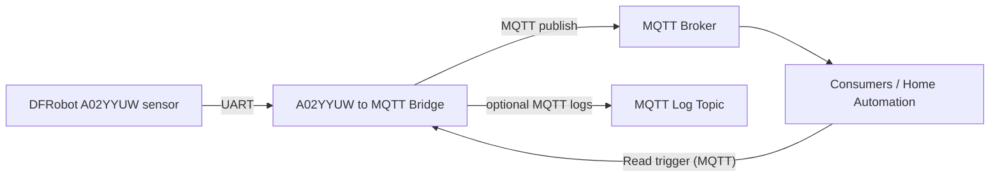

# A02YYUW to MQTT

Bridges a DFRobot A02YYUW ultrasonic sensor to MQTT by reading distance frames from a serial port, validating and filtering values, and publishing measurements to configurable MQTT topics. Useful for home automation, logging, and telemetry.

**High-Level Architecture**



**Environment variables / CLI options**

The program accepts both CLI flags and environment variables. Common names (from `main.py`):

- `SERIAL_PORT` (default: `/dev/ttyUSB0`)
- `MQTT_HOST` (required unless provided via `--mqtt-host`)
- `MQTT_PORT` (default: `1883`)
- `MQTT_USER`, `MQTT_PASS` (optional)
- `MQTT_VALUE_TOPIC` (topic to publish distance values)
- `MQTT_LOG_TOPIC` (optional topic to publish logs)
- `MQTT_LOG_LEVEL` (default: `ERROR`)
- `MQTT_READ_TRIGGER_TOPIC` (optional; publish `1` to trigger a single read)
- `MQTT_PUSH_INTERVAL_SECONDS` (default: `60`)
- `LOG_FILE` (set to `stdout` to log to stdout)
- `LOG_LEVEL` (default: `INFO`)

Run `python main.py --help` for full list of options.

## Setup

Prerequisites:

- Python 3.12+ (for native run) *or*
- Docker (for containerized runs)
- An MQTT broker reachable from the host (public broker or local like Mosquitto)
- Any USB-to-Serial adapter compatible with the A02YYUW sensor (e.g. Silicon Labs CP210x UART Bridge)

### Native (pip)

1. Install dependencies:

```bash
pip install -r requirements.txt
```

2. Run with appropriate CLI arguments:

```bash
python main.py \
    --serial-port /dev/ttyUSB0 \
    --mqtt-host broker.hivemq.com \
    --mqtt-value-topic myhome/a02/distance \
    --log-file a02.log
```

### Docker

Run container (map the serial device into the container) using the official image:

```bash
docker run --rm \
	-v /dev/ttyUSB0:/dev/ttyUSB0 \
	-e MQTT_HOST=broker.hivemq.com \
	-e MQTT_VALUE_TOPIC=myhome/a02/distance \
	-e LOG_FILE=stdout \
	ghcr.io/r0wi/a02yyuw-to-mqtt:latest
```

**Notes:**

- Use `-v /dev/ttyUSB0:/dev/ttyUSB0` to give the container access to the USB serial device.
- The container process runs with user ID 1000; ensure that this user has permission to access the serial device. Usually adding your *host* user with ID 1000 to the `dialout` group should suffice.
- If your broker requires auth, pass `-e MQTT_USER=... -e MQTT_PASS=...`.

### Docker Compose (example)

Create a `docker-compose.yml` like this:

```yaml
services:
	a02-bridge:
		image: ghcr.io/r0wi/a02yyuw-to-mqtt:latest
		devices:
			- "/dev/ttyUSB0:/dev/ttyUSB0"
		environment:
			- MQTT_HOST=broker.hivemq.com
			- MQTT_VALUE_TOPIC=myhome/a02/distance
			- LOG_FILE=stdout
```

Start with:

```bash
docker compose up -d
```

## Troubleshooting

- Always check logs (file or stdout) for errors.
- Permission errors accessing the serial device: ensure your user has permission to read the device (add to `dialout` group or run with elevated privileges).
- If MQTT connect fails, verify `MQTT_HOST`/`MQTT_PORT` and credentials.
